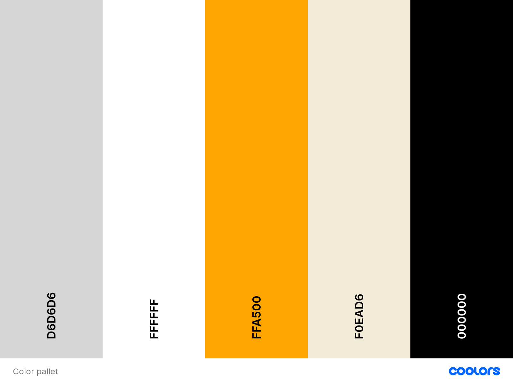

# Online Cookbook

learn how to cook

- [Online Cookbook](#online-cookbook)
  - [Project goals](#project-goals)
  - [UX](#ux)
    - [User Goals](#user-goals)
    - [Scope](#scope)
  - [Structure of the website](#structure-of-the-website)
    - [View for a guest user](#view-for-a-guest-user)
    - [View for logged in user](#view-for-logged-in-user)
    - [User Stories](#user-stories)
    - [Site owner goals](#site-owner-goals)
  - [User Requirements and Expectations](#user-requirements-and-expectations)
    - [Requirements](#requirements)
    - [Expectations](#expectations)
  - [Design Choices](#design-choices)
    - [Colors](#colors)
    - [Fonts](#fonts)
    - [Icons](#icons)
    - [Structure](#structure)
  - [Wireframes, Flowcharts and Data Models](#wireframes--flowcharts-and-data-models)
    - [Wireframes](#wireframes)
    - [Flowcharts](#flowcharts)
    - [Data Models](#data-models)
      - [Database Structure](#database-structure)
  - [Features](#features)
    - [Features that are implemented](#features-that-are-implemented)
    - [Features to be implemented](#features-to-be-implemented)
  - [Technologies used](#technologies-used)
    - [Languages](#languages)
    - [Libraries and Frameworks](#libraries-and-frameworks)
    - [Tools](#tools)
  - [Testing](#testing)
    - [Testing user stories](#testing-user-stories)
  - [Manual testing](#manual-testing)
    - [From validating](#from-validating)
  - [Bugs](#bugs)
    - [In development](#in-development)
  - [Deployment](#deployment)
    - [Local Deployment](#local-deployment)
  - [Credit](#credit)
    - [Text Credits](#text-credits)
    - [Image credits](#image-credits)
    - [Code credits](#code-credits)
    - [Special thanks](#special-thanks)

## Project goals

A lot of people find cooking a very fun activity. But you can't know how to cook everything from the top of your head. This online cookbook provides it's users with a place to look up existing recipes. If they create an account, they will have the possibility to create their own recipes and add them to the cookbook.

## UX

### User Goals

- The website has to be responsive on mobile phones, tables and desktops.
- The login procedure should be clear and feedback should be given when appropriate.
- The account creation process should be clear, easy to do and feedback should be given when appropriate.
- The creation of a new recipe should be easy to do. And easy to find when created.
- Searching for a recipe should be straight forward.
- The appearance of the site should be simple but attractive.

### Scope

An responsive and easy to navigate website that is easy to use and allows users to perform CRUD operations. As a user you can sign up and, once logged in, create your own recipes. The user can manage their own recipes, meaning they can edit and delete them if they want to.
They can also update their password and username if they want to, and even delete their account.

## Structure of the website

### View for a guest user

A user that is not logged in and/or registered, will see the same homepage as a logged in user. With the exception of the navigation bar. That will show the tabs: Sign in and Create account, instead of the tab Account and the tab Log out that a logged in user will see in the navigation bar.

### View for logged in user

A logged in user will benefit from the full functionality of the site. When logged in a user will be able to create their own recipes, keep track of and edit their own recipes, view and add to their favorite recipes and change their account settings by accessing the Account dropdown tab in the navigation bar which contains(My recipes, Add new recipe, My favourites, settings).

### User Stories

- As a user, I would like to be able to create an account so I can add my own recipes.
- As a user, I want to be able to add my own recipes.
- As a user, I want to be able to edit my added recipes.
- As a user, I want to be able to see my added recipes.
- As a user, I want to be able to save recipes I like and want to use later.
- As a user, I would like to have a account page Where I can see my username.
- As a user, I want to be able to logout of my account.
- As a user, I want to be able to change my username and password.
- As a user, I want to be able to delete my account.
- As a user, I want the website to be easy to use.

### Site owner goals

- To have an simple but attractive website where users can find and create recipes.
- To enable users to cook meals they would have never been able to without the recipes provided.
- To have users create their own cookbook from recipes found on the website.

## User Requirements and Expectations

### Requirements

- Easy to navigate by using tabs and buttons
- Easy to use account page
- Easy way to create a new recipe
- Easy way to edit or delete an existing recipe
- Easy way to save recipes, to be used later

### Expectations

- To have a clear list of your favorite recipes.
- To have a clear recipe list, which is easy to navigate.
- It should be easy to add a new recipe or to change an existing recipe.

## Design Choices

The design choices I made are based on wanting an straight forward site that fulfills the user purpose for visiting the site as easy as possible.
I wanted to keep the design simple so you can access the info you need as fast as possible.

### Colors

I made use of [Coolors](https://coolors.co/) for creating the color scheme used on this site.



- F0EAD6: Is more of a light beige color to take away most white backgrounds to make the site a little less harsh on the eyes.
- FFFFFF: Standard white, mostly used as background color for the create recipe form and account page.
- D6D6D6: Mainly used for the navigation bar on the top and bottom.
- FFA500: Color used for most icons, lines and borders. But also used for most button.
- 000000: Main font color. But also for some icons.

### Fonts

The fonts I’ll be using are:

[Roboto Slab:](https://fonts.google.com/specimen/Roboto+Slab) For the website title, recipe titles, navigation bar and section headers.

[Open sans](https://fonts.google.com/specimen/Open+Sans) Main font used on site. More specific for the ingredients lists and cook directions.

The fonts are from [Google Fonts.](https://fonts.google.com/)

### Icons

Icons used are from [Font Awesome.](https://fontawesome.com/) The are used in moderation. Mainly for the navigation bar and for the recipes.

### Structure

For the structure of the site I have used [Materialize](https://materializecss.com/). After using Bootstrap in my previous projects, I thought it would be smart to familiarize myself with a different framework.

## Wireframes, Flowcharts and Data Models

### Wireframes

I made my wireframes with [Balsamiq](https://balsamiq.com/)

View my wireframes [here](https://github.com/ThomasMSmit/Online-Cookbook/tree/master/readmecontent/wireframes)

Direct link to wireframes:
[Desktop](https://github.com/ThomasMSmit/Online-Cookbook/blob/master/readmecontent/wireframes/Wireframes_Desktop.pdf)
[Tablet/Mobile](https://github.com/ThomasMSmit/Online-Cookbook/blob/master/readmecontent/wireframes/Wireframes_Tablet_Mobile.pdf)

### Flowcharts


### Data Models


#### Database Structure

## Features

### Features that are implemented

- Registration functionality
- Log In and Out functionality
- Add a new recipe
- Edit an existing recipe
- Save favorite recipes
- CRUD Functions:
  - Create: possibility to create a new recipe and edit an existing recipe.
  - Read: A recipe page where the user can read all recipes that are on the website, as well as a My recipe page where logged in users can see what recipes they have added.
  - Update: possibility to edit the recipes added by the logged in user. and the possibility to change username and/or password.
  - Delete: possibility to delete created recipes that a logged in user has added and the possibility to delete your account.

### Features to be implemented

- A Chatroom for users to talk about the recipes they created. Or to ask questions about existing recipes.
- The ability to add instruction videos to created recipes for more in depth explanation.
- More extensive filter options on the recipes page. For example a filter for allergies, preparation time and what kind of meal(Breakfast, lunch, Dinner).

## Technologies used

### Languages

- [HTML](https://developer.mozilla.org/en-US/docs/Web/HTML)
- [CSS](https://developer.mozilla.org/en-US/docs/Web/CSS)
- [JS](https://nl.wikipedia.org/wiki/JavaScript)
- [Python](https://www.python.org/)

### Libraries and Frameworks

- [Font Awesome](https://fontawesome.com/)
- [Materialize](https://materializecss.com/)
- [Google Fonts](https://fonts.google.com/)
- [jQuery](https://jquery.com/)

### Tools

- [Git](https://git-scm.com/)
- [GitPod](https://www.gitpod.io/)
- [Github](https://github.com/)
- [Heroku](https://www.heroku.com/)
- [Balsamiq](https://balsamiq.com/)
- [PEP8](http://pep8online.com/)
- [W3C HTML Validation Service](https://validator.w3.org/)
- [W3C CSS Validation Service](https://jigsaw.w3.org/css-validator/)
- [MongoDB Atlas](https://www.mongodb.com/)
- [Flask](https://flask.palletsprojects.com/en/1.1.x/)
- [PyMongo](https://api.mongodb.com/python/current/tutorial.html)
- [Chromium](https://www.chromium.org/Home)
- [TinyPNG](https://tinypng.com/)
- [For generating a table of content:](http://ecotrust-canada.github.io/markdown-toc/)

## Testing

### Testing user stories


## Manual testing

### From validating


## Bugs

### In development

Bug: jinja2.exceptions.TemplateSyntaxError: Unexpected end of template.

Fix: Added %endblock% to recipe.html file as it was not there.

Bug: AttributeError: 'Cursor' object has no attribute 'find'.

Fix: By adding mongo.db to allergens = list in the recipe function in the run.py file.

## Deployment

### Local Deployment

I have created Online Cookbook using Github, from there I used Gitpod to write my code. Then I used commits to git followed by "git push" to my GitHub repository.
I've deployed this project to Heroku and used "git push heroku master" to make sure my pushes to GitHub were also made to Heroku.

This project can be ran locally by following the following steps: ( I used Gitpod for development, so the following steps will be specific to Gitpod. You will need to adjust them depending on your IDE.
You can find more information about installing packages using pip and virtual environments [here](https://packaging.python.org/guides/installing-using-pip-and-virtual-environments/)

**To clone the project:**

- From the application's repository, click the "code" button and download the zip of the repository. Alternatively, you can clone the repository using the following line in your terminal:
    git clone ``https://github.com/ThomasMSmit/Online-Cookbook.git``

- Access the folder in your terminal window and install the application's required modules using the following command:
    pip3 install -r requirements.txt

- Sign-in or sign-up to MongoDB and create a new cluster

    ◦ Within the Sandbox, click the collections button and after click Create Database (Add My Own Data) called online_cookbook

    ◦ Set up the following collections: allergens, cuisines, ingredients, recipes, users. Click [here](#database-structure) to see the exact Database Structure

    ◦ Under the Security Menu on the left, select Database Access.

    ◦ Add a new database user, and keep the credentials secure

    ◦ Within the Network Access option, add IP Address 0.0.0.0

- In your IDE, create a file containing your environmental variables called env.py at the root level of the application. It will need to contain the following lines and variables:
    import os

    ``` os.environ["IP"] = "0.0.0.0"
        os.environ["PORT"] = "5000"
        os.environ["SECRET_KEY"] = "YOUR_SECRET_KEY"
        os.environ["DEBUG"] = "True"
        os.environ["MONGO_URI"] = "YOUR_MONGODB_URI"
        os.environ["MONGO_DBNAME"]= "DATABASE_NAME"
    ```

    Please note that you will need to update the SECRET_KEY with your own secret key, as well as the MONGO_URI and MONGO_DBNAME variables with those provided by MongoDB.
    Tip for your SECRET_KEY, you can use a Password Generator in order to have a secure secret key. I personally recommend a length of 24 characters and exclude symbols.
    To find your MONGO_URI, go to your clusters and click on connect. Choose connect your application and copy the link provided. Don't forget to update the necessary fields like password and database name.
    If you plan on pushing this application to a public repository, ensure that env.py is added to your .gitignore file.

- The application can now be run locally. In your terminal, type the following command
    python3 app.py.

**To deploy your project on Heroku, use the following steps:**

- Login to your Heroku account and create a new app. Choose your region.
- Ensure the Procfile and requirements.txt files exist are present and up-to-date in your local repository.

**Requirements:**

``` pip3 freeze --local > requirements.txt ```

**Procfile:**

``` echo web: python app.py > Procfile ```

- The Procfile should contain the following line:

``` web: python app.py ```

**And then:**

- Scroll down to "deployment method"-section. Choose "Github" for automatic deployment.

- From the inputs below, make sure your github user is selected, and then enter the name for your repo. Click "search". When it finds the repo, click the "connect" button.

  - Scroll back up and click "settings".
    - Scroll down and click "Reveal config vars".
    - Set up the same variables as in your env.py (IP, PORT, SECRET_KEY, MONGO_URI and MONGODB_NAME): !You shouldn't set the DEBUG variable in under config vars, only in your env.py to prevent DEBUG being active on live website.

    ``` IP = 0.0.0.0
        PORT = 5000
        SECRET_KEY = YOUR_SECRET_KEY
        MONGO_URI = YOUR_MONGODB_URI
        MONGO_DBNAME = DATABASE_NAME
    ```

- Scroll back up and click "Deploy". Scroll down and click "Enable automatic deployment".
- Just beneath, click "Deploy branch". Heroku will now start building the app. When the build is complete, click "view app" to open it.
- In order to commit your changes to the branch, use git push to push your changes.

## Credit

### Text Credits


### Image credits


### Code credits

[Keith Scully](https://github.com/Code-Institute-Submissions/online-cookbook-4/blob/master/README.md)

### Special thanks


**Site for educational purposes only!**
